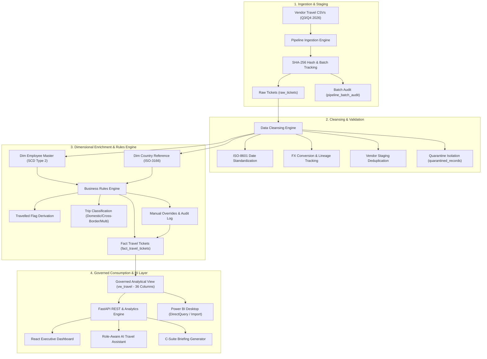
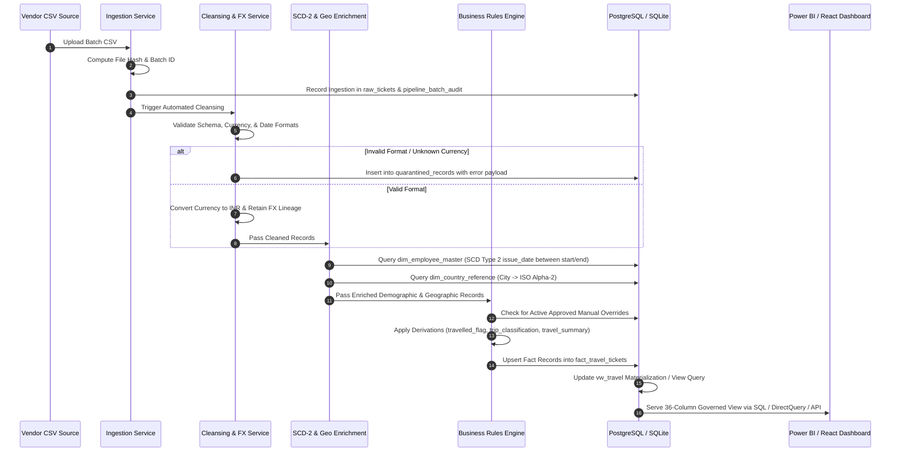
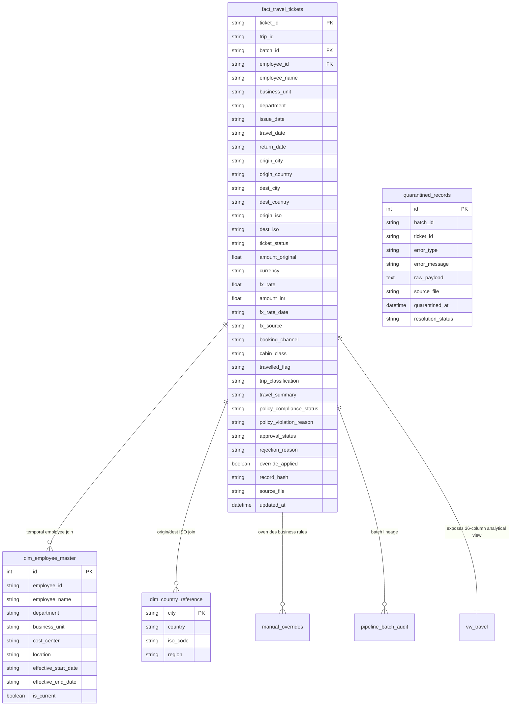

# Corporate Travel & Expense Intelligence Platform (PS-04)
## System Architecture & Technical Specifications

---

### 1. Executive System Overview
The **Corporate Travel & Expense Intelligence Platform** is an enterprise-grade ETL, warehouse analytics, and BI reporting solution engineered to ingest multi-vendor corporate travel records, execute automated data cleansing, apply temporal Slowly Changing Dimension (SCD Type 2) enrichments, derive business rules, support audited manual overrides, and expose an authoritative 36-column analytical view (`vw_travel`) to Power BI, executive dashboards, and AI services.

---

### 2. High-Level Architecture

---

### 3. End-to-End Data Pipeline Flow

---

### 4. Database Schema & Data Models

#### 4.1 Star-Schema Data Model

#### 4.2 Slowly Changing Dimension (SCD Type 2) Architecture
Employee organizational transfers (e.g. employee transitioning from Engineering to Product Management) are captured with validity intervals (`effective_start_date` and `effective_end_date`).
- When historical tickets are enriched, the join condition matches `ticket.issue_date BETWEEN dim.effective_start_date AND dim.effective_end_date`.
- This guarantees historical spend reporting accurately reflects the employee's department at the time of booking.

#### 4.3 Governed BI View (`vw_travel`)
The database view `vw_travel` serves as the single source of truth for all downstream reporting:
- Direct projection of all 36 canonical fields.
- Available natively in PostgreSQL (`public.vw_travel`) and SQLite.
- Enables seamless DirectQuery and Import mode querying in Power BI Desktop and Power BI Service.

---

### 5. Security & Authentication Architecture

1. **Password Security**: Passwords are saved with salted PBKDF2-HMAC-SHA256 hashing utilizing cryptographically random per-user 16-byte hex salts (`os.urandom(16)`).
2. **JWT Token Lifecycle**: Stateless HS256 JWT tokens with strict signature validation. If `JWT_SECRET_KEY` is not provided in production, the application refuses to start.
3. **Role-Based Access Control (RBAC)**:
   - `admin`: Full system control, pipeline trigger, user management, override approvals.
   - `manager`: Business unit filtering, manual override submission, data health auditing, executive briefing download.
   - `employee`: Scoped profile viewing, personal travel allowance and policy assistance.
4. **Security Headers**: Injected via ASGI middleware on every response (`X-Content-Type-Options: nosniff`, `X-Frame-Options: DENY`, `Strict-Transport-Security`).

---

### 6. Power BI Integration Architecture

1. **Direct Connection**: Power BI connects to PostgreSQL `localhost:5433` (Database: `travel_analytics`) querying `vw_travel`.
2. **Authoritative PowerQuery M Script**: Located at `powerbi/PowerQuery.m`, enforcing column types, uppercase standardizations, and date parsing.
3. **Standardized DAX Measures**: Located at `powerbi/Measures.dax`, implementing:
   - `Total Spend INR = SUM(vw_travel[amount_inr])`
   - `Flown Spend INR = CALCULATE(SUM(vw_travel[amount_inr]), vw_travel[travelled_flag] = "Y")`
   - `Travelled Trips = CALCULATE(DISTINCTCOUNT(vw_travel[trip_id]), vw_travel[travelled_flag] = "Y")`
   - `Compliance Rate % = DIVIDE(CALCULATE(COUNTROWS(vw_travel), vw_travel[policy_compliance_status] = "COMPLIANT"), COUNTROWS(vw_travel), 0)`
4. **Templates & Artifacts**:
   - `powerbi/Corporate_Travel_Analytics.pbix`
   - `powerbi/PowerBI_Setup_Guide.md`
   - `powerbi/DataModel.md`
   - `powerbi/Report_Design.md`

---

### 7. DevOps & Infrastructure

- **Containerization**: Multi-stage `Dockerfile` and `docker-compose.yml` defining the backend FastAPI service and PostgreSQL 16 database, binding to `0.0.0.0:8000`.
- **Health Probes**:
  - `GET /health`: Liveness probe for orchestrators.
  - `GET /health/db`: Readiness probe verifying live database connectivity.
- **CI/CD Automation**:
  - `.github/workflows/ci.yml`: Automated linting, static analysis, and pytest validation on all pushes and pull requests.
  - `.github/workflows/cd.yml`: Automated container build, tagging, staging deployment, and health probe verification.
