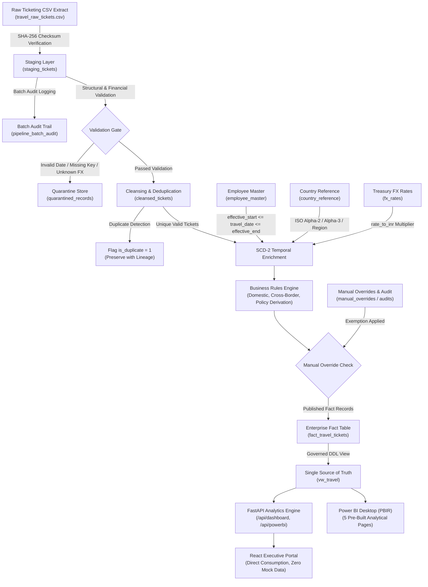

# MassMutual Corporate Travel Analytics — End-to-End Data Lineage Architecture (PS-04)

This document traces the complete technical and data lineage of the Corporate Travel Analytics Pipeline from vendor CSV ingestion to the final analytical view (`vw_travel`), FastAPI backend, React dashboard, and Power BI report.

---

## 1. Pipeline Stages & Architectural Trace

### Stage 1: Raw Ingestion & Source-File Idempotency
- **Input**: Daily ticketing CSV extract from vendor.
- **Hash Verification**: Pipeline computes SHA-256 checksum of the source file. If an identical file hash has already been successfully processed, execution stops immediately and returns `{"status": "ALREADY_PROCESSED"}`, preventing duplicate transactions.
- **Concurrency Protection**: A non-blocking thread lock (`_PIPELINE_EXECUTION_LOCK`) ensures multiple concurrent runs are instantly rejected with `CONCURRENCY_LOCKED`.

### Stage 2: Staging Layer & Audit Initialization
- Landed records are copied directly into `staging_tickets` with raw string payloads, source file name, file hash, and assigned `batch_id`.
- A new record is registered in `pipeline_batch_audit` with state `RUNNING`.

### Stage 3: Data Quality & Quarantine Isolation
- **Error Taxonomy**:
  - `NULL_TICKET_ID`: Ticket ID missing or whitespace.
  - `INVALID_AMOUNT`: Amount missing, negative, or non-numeric.
  - `UNKNOWN_CURRENCY`: Currency code not recognized in `fx_rates`.
  - `INVALID_DATE`: Malformed issue/travel/return dates.
  - `MISSING_TRAVEL_DATE`: Mandatory departure date omitted.
- Failing records are diverted to `quarantined_records` with error type and message; pipeline processing continues safely for clean records.

### Stage 4: Cleansing, Normalization & Deduplication
- Locations are trimmed and normalized to title case; statuses converted to upper case.
- Natural ticket identity is hashed: `record_hash = SHA256(ticket_id + trip_id + travel_date + employee_id)`.
- If an identical record hash already exists in cleansed history, it is preserved in `cleansed_tickets` with `is_duplicate = 1` and excluded from warehouse fact publishing.

### Stage 5: SCD Type-2 Temporal Enrichment
- Tickets are joined against `employee_master` using the travel date window:
  $$\text{effective\_start\_date} \le \text{travel\_date} \le \text{effective\_end\_date}$$
- Populates `employee_name`, `business_unit`, `business_group`, and `department`.
- ISO Alpha-2 and Alpha-3 country codes are resolved from `country_reference`.

### Stage 6: Treasury FX Conversion Lineage
- Original fare is multiplied by effective treasury exchange rate stored in `fx_rates`.
- `amount_original`, `currency`, `fx_rate`, `amount_inr`, `fx_rate_date`, and `fx_source` are permanently preserved.

### Stage 7: Business Rules & Policy Compliance
- `travelled_flag` derived from booking status (`Y` for flown, `N` for cancelled/refunded).
- Multi-dimensional trip classification: Domestic, Cross-Border, Multi-Country.
- Policy violation checking: domestic business cabin caps, fare thresholds.

### Stage 8: Manual Override & Audit Sync
- Checks `manual_overrides` table for authorized exemptions. If present, override values replace derived values and `override_applied` is set to 1.
- Audit trail written to `manual_override_audits` capturing user identity from authenticated JWT token.

### Stage 9: Warehouse Fact Table & Governed View Publication
- Final enriched records written to `fact_travel_tickets`.
- Governed analytical view `vw_travel` exposes all operational and analytical attributes without duplication.
- Pipeline batch audit record updated to `SUCCESS` with exact reconciliation counts.
